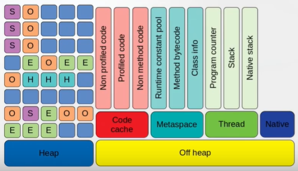

# java12-fundamentals-off-heap-allocation-workshop

* References
    * [WJUG #166 - On-heap cache vs Off-heap cache w Javie - Radek Grębski](https://www.youtube.com/watch?v=USDNmA86kws)
    * https://github.com/rgrebski/confitura2015/tree/master/offheap-test
    * https://dzone.com/articles/java-chroniclemap-part-1-go-off-heap
    * https://docs.oracle.com/javase/8/docs/technotes/guides/troubleshoot/tooldescr007.html
    
# preface
* goal of this workshop:
    * get accustomed with rudimentary java's diagnostic tools: 
    visualVM, jmap, jcmd
    * learn how to allocate objects in the native java memory (off-heap)
* exemplary solution is in answers package

# introduction
* java 9 memory model (assumption: g1)
    
* weak generational hypothesise: most objects die young
    * cache and http session don't follow it
* Off-Heap memory allows your cache data outside of main Java Heap 
space, but still in RAM
* off-heap is far more bigger than heap
* off-heap - no gc
* `jmap -histo <pid>`
    * prints the number of objects, memory size in bytes, and fully 
    qualified class name for each class
* `jcmd <pid> VM.native_memory | grep Internal`
    * if JVM was started with the flag `-XX:NativeMemoryTracking=summary`
    shows the amount off-heap memory being used
# project description
* we show how to allocate off-heap short array (using `Unsafe`)
    * `public long allocateMemory(long bytes)`
        * allocates a new block of native memory, of the given size in 
        bytes
        * contents of the memory are uninitialized
        * the resulting native pointer will never be zero, and will be 
        aligned for all value types
    * `public void setMemory(long address, long bytes, byte value)`
        * sets all bytes in a given block of memory to a fixed value
    * `public void putShort(long address, short x)`
        * stores a value into a given memory address
        * if the address is zero, or does not point into a block 
        obtained from `allocateMemory`, the results are undefined
    * `public short getShort(long address)`
        * fetches a value from a given memory address
        * if the address is zero, or does not point into a block 
        obtained from `allocateMemory`, the results are undefined
    * `public void freeMemory(long address)`
        * disposes of a block of native memory, as obtained from 
        allocateMemory or `reallocateMemory`
